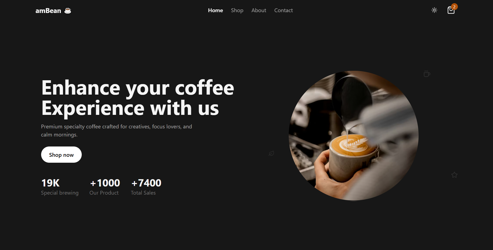

# 🚀 amBean Coffee Shop

**amBean** is a modern and responsive coffee store designed for a smooth and enjoyable user experience. It features a clean interface, product browsing, cart functionality, a virtual checkout, and dedicated About & Contact pages.
This project showcases my skills, projects, and experience with a clean UI, smooth animations, and modern design principles.

---

## 🌐 Live Demo

🔗 https://ambean-coffee-shop.vercel.app/

---

## 📌 Features

- Browse products and add them to the cart
- Fully responsive design
- Smooth animations with Framer Motion
- Virtual checkout with a user input form
- About page showcasing team, process steps, and company numbers
- Contact page with a send message form and toast notifications
- Dark mode support
- Temporary cart storage via Local Storage

---

## 📸 Screenshots

## 

---

## 🛠️ Technologies Used

- **React.js + TypeScript**
- **Vite** as the build tool
- **Tailwind CSS** for fast and responsive styling
- **Framer Motion** for animations
- **React Router** for page navigation
- **React Hot Toast** for quick notifications
- **Local Storage** to store cart items temporarily
- **Vercel** for hosting and deployment

---

## 📂 Project Structure

````txt
amBean/
├─ src/
│ ├─ components/
│ │ ├─ about/ # AboutHero, AboutProcess, AboutTeam, AboutNumbers ...
│ │ ├─ cart/ # CartDrawer
│ │ ├─ checkout/ # CheckoutForm ...
│ │ ├─ contact/ # ContactForm ...
│ │ ├─ layout/ # Footer, Navbar
│ │ ├─ product/ # ProductModal, ProductItem
│ │ ├─ shop/ # ShopSidebar
│ │ ├─ ui/ # Container
│ │ ├─ routes/ # AppRoutes
│ │ └─ sections/ # Products ...
│ │
│ ├─ context/ # CartContext
│ ├─ data/ # Product data
│ ├─ hooks/ # useTheme
│ ├─ layouts/ # MainLayout
│ ├─ pages/ # Home.tsx, Shop.tsx, About.tsx, Contact.tsx, Checkout.tsx
│ └─ App.tsx
│
├─ public/
├─ package.json
└─ README.md

---

## 💻 Running Locally

1. Clone the repository:
```bash

git clone https://github.com/<username>/amBean.git
cd amBean

npm install
npm run dev

---
````

## 👨‍💻 Author

**Ali Asaad**

Front-End Developer | React.js

- GitHub: [https://github.com/aliasaad01](https://github.com/aliasaad01)

- ⭐ If you like this project, give it a star!
